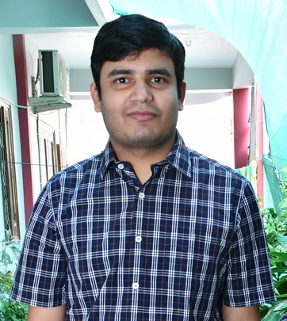
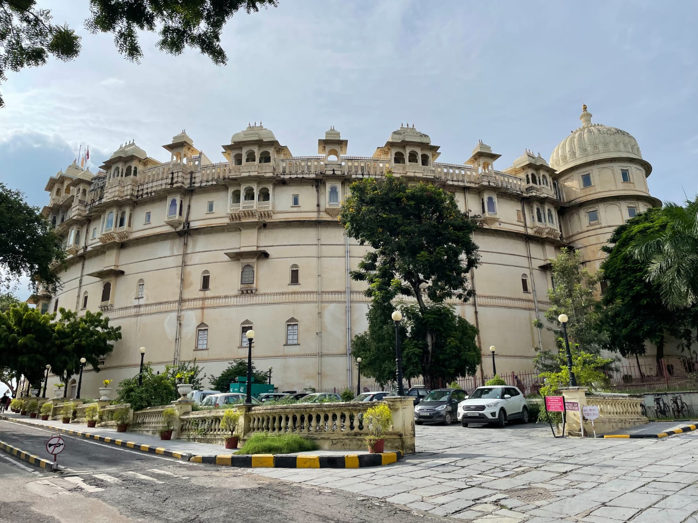
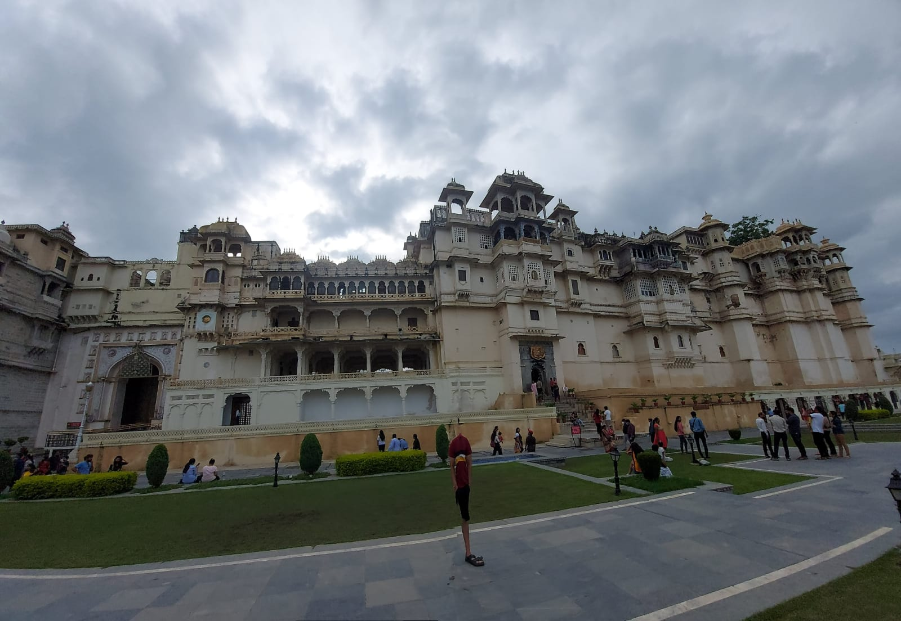
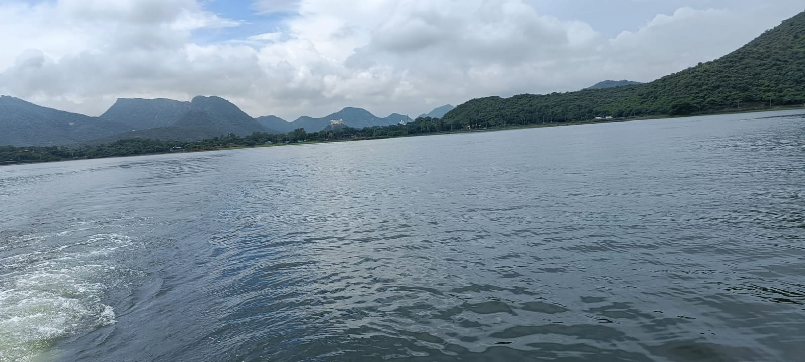
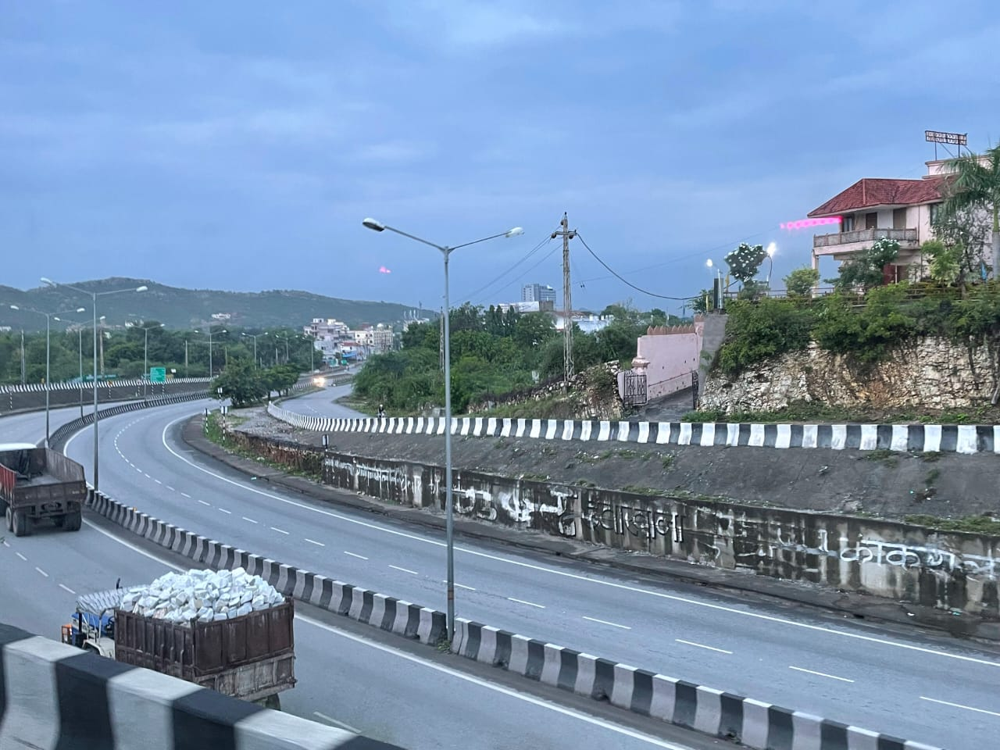

## About me

Hi, my name is Anurag and I am a Software Engineer who focuses on content related to software engineering and machine learning!  

I grew up in the great state of Rajasthan in India. From an early age, I always loved math. I started coding in college. I found it a creative way to apply the same type of logical thinking skills that I enjoyed with math. This influenced me to study software development and machine learning and ultimately create blogs to share some things that I have learned along the way.

## Hobbies

I love coding and automating/solving daily life issues. I also love doing all sorts of active things. I like to play table tennis & badminton as well as run, skate, and surf. In addition to sports, I am a board game enthusiast, I like playing chess. I also love watching Anime.

## Fun Facts

 - Favourite video game - counter-strike, GTA, FIFA
 - Favourite Anime - Full metal alchemists, Naruto
 - Favourite books - JAVA Concurrency In Practice, Clean code, pragmatic programmer, Test Driven Development
 - Love Indian food over western food
 - Pure vegetarian
 - Like Lata Mangeshkar and Kishor Kumar songs

## Social Media
I encourage you to check out my content on all social media platforms

    Instagram: https://www.instagram.com/anuragsharma3042/
    LinkedIn: https://www.linkedin.com/in/anurag-sharma-568006113/
    GitHub: https://github.com/limo-756

## Photos
Here are a few photos from a trip to Udaipur I took last year

- 
- 
- 
- 

## My Reading Todo List

- JVM warm-up and code-optimization paths. Resources [1](https://www.baeldung.com/java-microbenchmark-harness)
